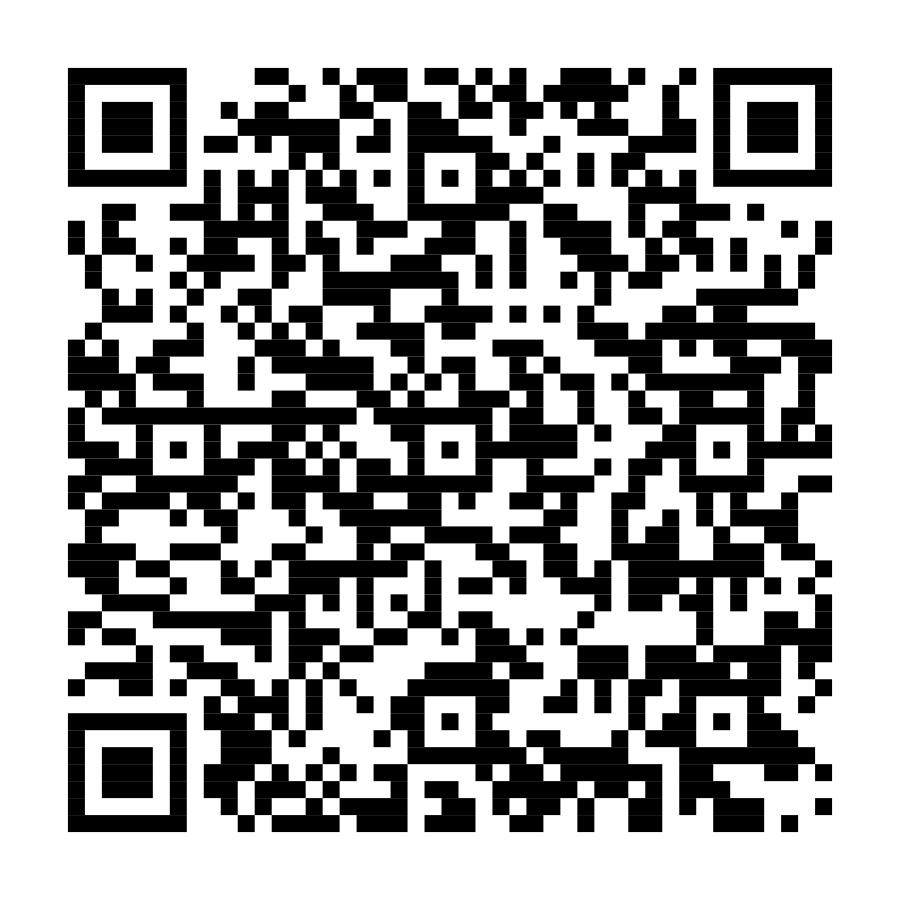

# ⛏️ WortWelt – Lernspiel für Vorschule bis Klasse 4

Ein gamifiziertes, browserbasiertes Lernspiel für die Grundschule (Lehrplan NRW).
Offline lauffähig, anonym, ohne Anmeldung – optimiert fürs iPad.

**▶️ Live spielen:** https://nielsfeels-2.github.io/wortwelt/

## Klassen

Oben im Hub lässt sich die **Klassenstufe** wählen: **Vorschule, Klasse 1, Klasse 2, Klasse 3 und Klasse 4**. Jede Klasse hat eigene, altersgerecht aufbauende Level je Fach.

## Fächer (NRW)

- **📖 Deutsch** – Vorschule: erste Laute, Buchstaben, Silben klatschen. Klasse 1: Anlaute, Groß-/Kleinschreibung, Silben, Wörter lesen, Blitzlesen, Lückenwörter, Wörter schreiben, Sätze & Satzverständnis. Klasse 2: ie/ck/Doppelmitlaute/sp-st/Umlaute, Wortarten, Satzzeichen, Lesen, ABC. Klasse 3: Verlängern (b/d/g), Dehnungs-h, Vorsilben, Adjektive steigern, Wortfamilien, Präsens/Präteritum, Satzglieder, wörtliche Rede, Lesen, Wörterbuch. Klasse 4: s/ss/ß, zusammengesetzte Nomen, Wortarten (Pronomen/Präpositionen), Perfekt, Satzarten, Textsorten, Synonyme, Fremdwörter, Satzzeichen
- **🔢 Mathe** – Vorschule: Zählen bis 10, Formen, Größenvergleich, Muster. Klasse 1: Zählen & Mengen bis 10, Plus & Minus bis 10, Rechnen bis 20. Klasse 2: Zahlenraum 100, kleines 1×1, Geld, Uhr, Sachrechnen. Klasse 3: Zahlenraum 1000, schriftliches Plus/Minus, komplettes 1×1 inkl. Geteiltrechnen, Längen/Gewichte/Zeit, Fläche & Umfang, Sachrechnen. Klasse 4: Zahlenraum bis 1 Million, schriftliches Multiplizieren/Dividieren, Teiler & Vielfache, Brüche, Dezimalzahlen, Volumen, Diagramme
- **🌍 Sachunterricht** – alle Lehrplan-Bereiche pro Klassenstufe, in Klasse 4 vertieft: Deutschland & Europa, Stromschaltungen, Trinkwasser & Klimaschutz, Verdauung & Pubertät, Mittelalter & Zeitleiste, Medienkompetenz & Berufe
- **🎵 Musik** – Instrumente, laut/leise · hoch/tief · schnell/langsam, Singen & Rhythmus, in Klasse 4 vertieft: Notennamen, Dynamik, Weltmusik, Bandinstrumente, Musikgeschichte, digitale Musik
- **🇬🇧 Englisch** – ab Klasse 3 (Beginn des Englischunterrichts in NRW), in Klasse 4 erweitert um Uhrzeit, Einkaufen, Wegbeschreibungen, Hobbys, Personen beschreiben, Simple Past, Fragen stellen, Wetter, Monate, Berufe, Schulfächer – mit automatischer englischer Sprachausgabe

Oben im Startbildschirm („Hub") lässt sich zwischen Klassenstufe und Fach umschalten. Avatar, Edelsteine und Erfolge sind fächer- und klassenübergreifend, die Level-Fortschritte pro Klasse und Fach getrennt.

## Üben, was noch wackelt (Spaced Repetition)

Falsch beantwortete Aufgaben landen in einer **Übungskiste pro Fach**. In der 🎯 Übungs-Challenge kommen die **schwächsten Aufgaben zuerst**; eine Aufgabe gilt erst als gelernt, wenn sie mehrmals (an verschiedenen Tagen) richtig beantwortet wurde (Leitner-Prinzip). So wird gezielt das wiederholt, was das Kind noch nicht sicher kann.

## Für wen?

Kinder im ersten Schuljahr – auch für Nichtleser geeignet: Alle Aufgaben werden per Sprachausgabe vorgelesen (Zahlen und Rechenaufgaben als „2 plus 3 gleich 5").

## Spielprinzip (kindgerecht & fair)

- Jedes Level ist ein kleiner Monster-Kampf: sechs richtige Aufgaben besiegen das Monster.
- **Belohnung nur für echtes Lernen** – Edelsteine (💎) gibt es ausschließlich für richtige Antworten. Kein Echtgeld, keine Käufe, kein Pay-to-win.
- **Fehler kosten nie Fortschritt.** Ein optionaler, abschaltbarer Schaden-Modus bietet mehr Herausforderung.
- **Eigener Avatar** aus selbst gezeichneten SVG-Figuren: drei Grundtypen (Minen-Kind, Tier, Roboter), frei einfärbbar, mit Gesicht, Hut, Werkzeug und Begleiter – im Avatar-Studio zusammenstellbar (Farben gratis, Extra-Teile per Edelstein, manche Teile durch Erfolge).
- Variable Belohnungen, Sammel-Schatzkammer, Tages-Challenge und ein Fehler-Training halten motiviert – ohne Kinder unter Druck zu setzen (Session-Bremse nach ~3 Einheiten).
- **Erwachsenen-Ecke** mit Lernstand (richtige Antworten, Quote, Übungsbedarf) für Eltern und Lehrkraft.

## Datenschutz

Keine Accounts, kein Tracking, keine Namen. Der Spielstand wird ausschließlich lokal im Browser (`localStorage`) gespeichert. DSGVO-freundlich.

## Technik

- **Eine einzige `index.html`** – kein Build-Schritt, kein Framework, kein CDN, keine externen Fonts oder Bilder. Grafik aus Emojis, CSS und Inline-SVG.
- Läuft offline in jedem modernen Browser; als Website über GitHub Pages bereitgestellt.

## Deployment (GitHub Pages)

Dieser Ordner ist der komplette Inhalt des Repos `nielsfeels-2/wortwelt`.
`index.html` liegt im Wurzelverzeichnis und wird von GitHub Pages direkt ausgeliefert.
Zum Aktualisieren einfach die neue `index.html` committen/hochladen – die Live-URL und der QR-Code bleiben gleich.

## Weiterentwicklung

`index.html` ist zugleich die Master-Datei und die WortWelt-Engine-Referenz. Technische Doku (Architektur, Aufgabentypen, Änderungslog) liegt im übergeordneten Projekt unter `14_LERNAPPS/WORTWELT-ENGINE.md`.

## Nutzung & Rechte

Eigenes Unterrichtsmaterial für den schulischen Einsatz. Emoji-Darstellung kann je nach Gerät/Betriebssystem leicht variieren.
